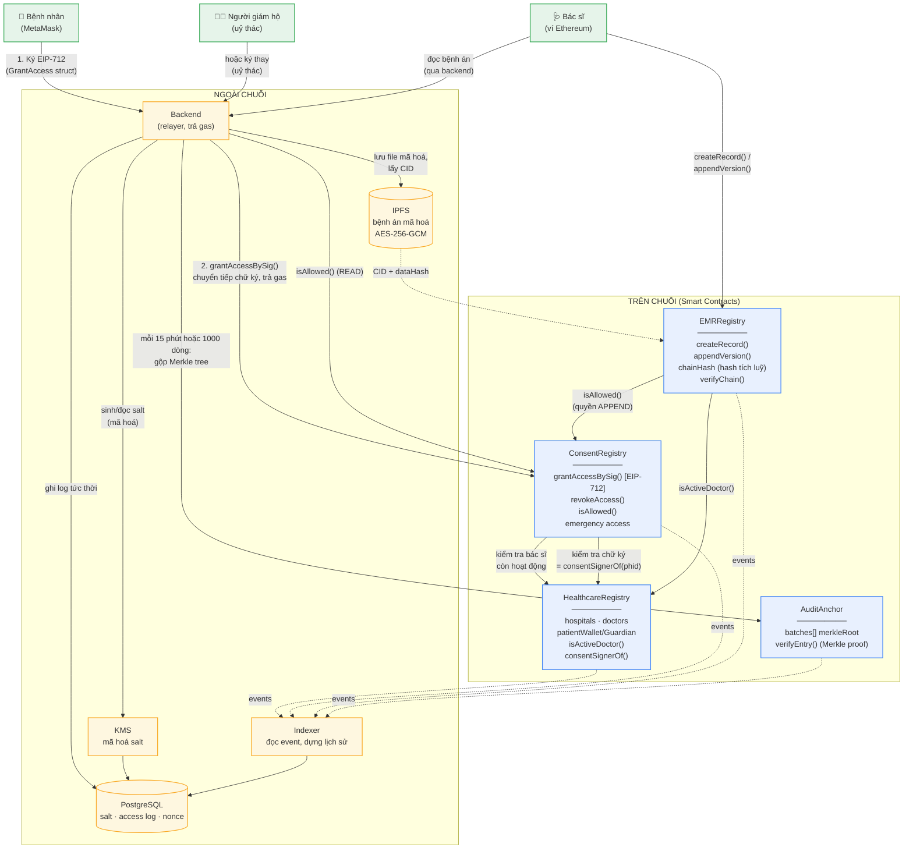

# Kiến trúc Smart Contract

## Mục lục

- [Kiến trúc Smart Contract](#kiến-trúc-smart-contract)
  - [Mục lục](#mục-lục)
  - [1. Tổng quan](#1-tổng-quan)
  - [2. Giải thích một số luồng cơ bản](#2-giải-thích-một-số-luồng-cơ-bản)
    - [2.1. Cấp quyền truy cập (consent)](#21-cấp-quyền-truy-cập-consent)
    - [2.2. Ghi bệnh án](#22-ghi-bệnh-án)
    - [2.3. Đọc bệnh án và nhật ký kiểm toán](#23-đọc-bệnh-án-và-nhật-ký-kiểm-toán)
    - [2.4. Định danh bệnh nhân (PHID)](#24-định-danh-bệnh-nhân-phid)
  - [3. Chi tiết các contract](#3-chi-tiết-các-contract)
    - [3.1. HealthcareRegistry](#31-healthcareregistry)
    - [3.2. ConsentRegistry](#32-consentregistry)
    - [3.3. EMRRegistry](#33-emrregistry)
    - [3.4. AuditAnchor](#34-auditanchor)

---

## 1. Tổng quan

Hệ thống chia làm hai tầng:

| Tầng | Thành phần | Vai trò |
| --- | --- | --- |
| **On-chain** | `HealthcareRegistry`, `ConsentRegistry`, `EMRRegistry`, `AuditAnchor` | Nguồn sự thật về danh tính, quyền truy cập, toàn vẹn dữ liệu |
| **Off-chain** | Backend (relayer), PostgreSQL, KMS, IPFS, Indexer | Lưu trữ dữ liệu mã hoá, trả gas, dựng lịch sử từ event |



---

## 2. Giải thích một số luồng cơ bản

### 2.1. Cấp quyền truy cập (consent)

1. Bệnh nhân (hoặc người giám hộ) ký struct `GrantAccess` theo chuẩn **EIP-712** ngay trên ví — không tốn gas.
2. Backend đóng vai **relayer**: chuyển tiếp chữ ký lên `ConsentRegistry.grantAccessBySig()` và trả gas thay.
3. Contract xác minh: bác sĩ còn hoạt động (`isActiveDoctor`), chữ ký đúng người ký hợp lệ (`consentSignerOf`), `nonce` chưa dùng, chưa quá `deadline`.

### 2.2. Ghi bệnh án

1. File bệnh án được mã hoá **AES-256-GCM** rồi đẩy lên IPFS → nhận `CID`.
2. Bác sĩ gọi `createRecord()` / `appendVersion()` với `dataHash` + `CID`.
3. Contract chỉ lưu `chainHash` (hash tích luỹ). `CID` và hash từng phiên bản **chỉ nằm trong event** — Indexer dựng lại lịch sử.
4. **Không có hàm sửa/xoá phiên bản cũ** — theo thiết kế (append-only).

### 2.3. Đọc bệnh án và nhật ký kiểm toán

1. Backend kiểm tra `isAllowed(..., READ)` trước mỗi lần đọc.
2. Mỗi lượt truy cập ghi log tức thời vào PostgreSQL.
3. Mỗi **15 phút** hoặc **1000 dòng**, backend gộp log thành Merkle tree và neo `merkleRoot` lên `AuditAnchor`.
4. Bất kỳ ai cũng chứng minh được một dòng nhật ký nằm trong lô đã neo bằng `verifyEntry()`, mà không cần tiết lộ các dòng còn lại.

### 2.4. Định danh bệnh nhân (PHID)

- `PHID` = hash có salt của định danh gốc. Salt được sinh/lưu qua **KMS**, không bao giờ lên chuỗi.
- Nhờ vậy on-chain không lộ thông tin định danh cá nhân (PII).

---

## 3. Chi tiết các contract

### 3.1. HealthcareRegistry

Nguồn sự thật về danh tính: bệnh viện, bác sĩ, bệnh nhân.

```solidity
// SPDX-License-Identifier: MIT
pragma solidity 0.8.24;

import {AccessControlUpgradeable} from "@openzeppelin/contracts-upgradeable/access/AccessControlUpgradeable.sol";

/// Nguồn sự thật về danh tính: bệnh viện, bác sĩ, bệnh nhân.
contract HealthcareRegistry is AccessControlUpgradeable {

    bytes32 public constant SYSTEM_ADMIN_ROLE   = keccak256("SYSTEM_ADMIN_ROLE");
    bytes32 public constant HOSPITAL_ADMIN_ROLE = keccak256("HOSPITAL_ADMIN_ROLE");

    enum Status { None, Active, Suspended, Revoked }

    struct Hospital {
        bytes32 code;        // mã cơ sở KCB do Bộ Y tế cấp
        Status  status;
        uint64  since;
    }

    struct Doctor {
        bytes32 hospitalCode;
        bytes32 licenseHash;  // hash có salt của số chứng chỉ hành nghề
        Status  status;
        uint64  since;
    }                                // gói vừa 2 slot

    mapping(bytes32 => Hospital) public hospitals;      // hospitalCode => hồ sơ
    mapping(address => Doctor)   public doctors;        // ví bác sĩ  => hồ sơ
    mapping(bytes32 => address) public patientWallet;   // PHID => ví (0x0 nếu uỷ thác)
    mapping(bytes32 => address) public patientGuardian; // PHID => ví đại diện được uỷ quyền

    event HospitalRegistered(bytes32 indexed code, address indexed admin);
    event DoctorRegistered(address indexed doctor, bytes32 indexed hospitalCode);
    event DoctorStatusChanged(address indexed doctor, Status oldStatus, Status newStatus);
    event PatientRegistered(bytes32 indexed phid, address wallet, address guardian);
    event PatientWalletLinked(bytes32 indexed phid, address indexed wallet);

    /// Admin bệnh viện đăng ký bác sĩ thuộc chính bệnh viện của mình.
    function registerDoctor(address doctor, bytes32 licenseHash, bytes32 hospitalCode)
        external onlyHospitalAdminOf(hospitalCode)
    {
        require(doctors[doctor].status == Status.None, "doctor exists");
        require(hospitals[hospitalCode].status == Status.Active, "hospital inactive");
        doctors[doctor] = Doctor(hospitalCode, licenseHash, Status.Active, uint64(block.timestamp));
        emit DoctorRegistered(doctor, hospitalCode);
    }

    /// Hàm mà ConsentRegistry và EMRRegistry gọi trước mọi thao tác ghi.
    function isActiveDoctor(address a) external view returns (bool) {
        Doctor storage d = doctors[a];
        return d.status == Status.Active
            && hospitals[d.hospitalCode].status == Status.Active;
    }

    /// Ai được ký thay bệnh nhân: chính bệnh nhân, hoặc người giám hộ được chỉ định.
    function consentSignerOf(bytes32 phid) external view returns (address) {
        address w = patientWallet[phid];
        return w != address(0) ? w : patientGuardian[phid];
    }
}
```

**Điểm chính**

- `Status` bốn trạng thái: `None` / `Active` / `Suspended` / `Revoked`.
- `licenseHash` là hash **có salt** — số chứng chỉ hành nghề không lộ on-chain.
- `struct Doctor` được đóng gói vừa **2 storage slot** để tiết kiệm gas.
- `isActiveDoctor()` kiểm tra **cả** bác sĩ lẫn bệnh viện còn hoạt động.

---

### 3.2. ConsentRegistry

Quản lý sự đồng ý (consent) của bệnh nhân bằng chữ ký EIP-712.

```solidity
contract ConsentRegistry is EIP712Upgradeable, PausableUpgradeable {

    enum ScopeKind { AllRecords, ByRecordType, SingleRecord }

    struct Grant {
        uint64 grantedAt;
        uint64 expiresAt;   // 0 = không thời hạn
        uint64 revokedAt;   // 0 = còn hiệu lực
        uint8  permissions; // bitmask READ|APPEND
    }                          // gọn trong 1 slot storage

    mapping(bytes32 => Grant)   private _grants;   // grantKey => Grant
    mapping(bytes32 => uint256) public  nonces;    // phid => nonce chống phát lại

    bytes32 private constant GRANT_TYPEHASH = keccak256(
        "GrantAccess(bytes32 phid,address grantee,uint8 scopeKind,bytes32 scopeRef,"
        "uint8 permissions,uint64 expiresAt,uint256 nonce,uint256 deadline)"
    );

    function _key(bytes32 phid, address g, ScopeKind k, bytes32 ref)
        internal pure returns (bytes32)
    {
        return keccak256(abi.encode(phid, g, k, ref));
    }

    /// Backend chuyển tiếp sự đồng ý mà bệnh nhân đã ký ngoài chuỗi.
    function grantAccessBySig(
        bytes32 phid, address grantee,
        ScopeKind kind, bytes32 scopeRef,
        uint8 permissions, uint64 expiresAt,
        uint256 deadline, bytes calldata signature
    ) external whenNotPaused {
        require(block.timestamp <= deadline, "signature expired");
        require(expiresAt == 0 || expiresAt > block.timestamp, "bad expiry");
        require(registry.isActiveDoctor(grantee), "grantee not active");

        uint256 nonce = nonces[phid]++;
        bytes32 digest = _hashTypedDataV4(keccak256(abi.encode(
            GRANT_TYPEHASH, phid, grantee, kind, scopeRef,
            permissions, expiresAt, nonce, deadline
        )));
        require(
            ECDSA.recover(digest, signature) == registry.consentSignerOf(phid),
            "invalid consent signature"
        );

        _grants[_key(phid, grantee, kind, scopeRef)] =
            Grant(uint64(block.timestamp), expiresAt, 0, permissions);

        emit AccessGranted(phid, grantee, kind, scopeRef, permissions, expiresAt);
    }

    /// Thu hồi: bệnh nhân tự gọi được, hoặc backend chuyển tiếp chữ ký.
    /// Cố tình KHÔNG có whenNotPaused — thu hồi phải chạy được kể cả khi hệ thống bị tạm dừng.
    function revokeAccess(bytes32 phid, address grantee, ScopeKind kind, bytes32 scopeRef)
        external
    {
        require(msg.sender == registry.consentSignerOf(phid), "not consent owner");
        bytes32 k = _key(phid, grantee, kind, scopeRef);
        require(_grants[k].grantedAt != 0 && _grants[k].revokedAt == 0, "no active grant");
        _grants[k].revokedAt = uint64(block.timestamp);
        emit AccessRevoked(phid, grantee, kind, scopeRef, uint64(block.timestamp));
    }

    /// Hàm quyết định. Backend gọi trước mỗi lần đọc; EMRRegistry gọi trước mỗi lần ghi thêm.
    function isAllowed(
        bytes32 phid, address grantee,
        uint256 recordId, bytes32 recordType, uint8 needed
    ) public view returns (bool) {
        if (!registry.isActiveDoctor(grantee)) return false;
        if (_ok(_key(phid, grantee, ScopeKind.SingleRecord, bytes32(recordId)), needed)) return true;
        if (_ok(_key(phid, grantee, ScopeKind.ByRecordType, recordType), needed))       return true;
        if (_ok(_key(phid, grantee, ScopeKind.AllRecords, bytes32(0)), needed))         return true;
        return _emergencyActive(phid, grantee);
    }

    function _ok(bytes32 k, uint8 needed) internal view returns (bool) {
        Grant storage g = _grants[k];
        return g.grantedAt != 0
            && g.revokedAt == 0
            && (g.expiresAt == 0 || g.expiresAt > block.timestamp)
            && (g.permissions & needed) == needed;
    }
}
```

**Phạm vi cấp quyền (`ScopeKind`)**

| Giá trị | Ý nghĩa | `scopeRef` |
| --- | --- | --- |
| `AllRecords` | Toàn bộ bệnh án của bệnh nhân | `bytes32(0)` |
| `ByRecordType` | Theo loại bệnh án | `recordType` |
| `SingleRecord` | Một bệnh án cụ thể | `bytes32(recordId)` |

**Điểm chính**

- `isAllowed()` kiểm tra theo thứ tự **hẹp → rộng**: `SingleRecord` → `ByRecordType` → `AllRecords` → truy cập khẩn cấp.
- `permissions` là bitmask `READ | APPEND`.
- `nonces[phid]` chống tấn công **phát lại (replay)** chữ ký.
- `revokeAccess()` **cố tình không có** `whenNotPaused` — thu hồi quyền phải chạy được ngay cả khi hệ thống tạm dừng.

---

### 3.3. EMRRegistry

Sổ cái bệnh án — append-only, có hash tích luỹ để xác minh toàn vẹn.

```solidity
contract EMRRegistry is PausableUpgradeable {

    struct Record {
        bytes32 phid;
        bytes32 recordType;
        bytes32 hospitalCode;
        bytes32 chainHash;    // hash tích luỹ của toàn bộ phiên bản
        address createdBy;
        uint64  createdAt;
        uint32  versionCount;
    }

    mapping(uint256 => Record) public records;
    uint256 public nextRecordId;

    // CID và hash từng phiên bản chỉ nằm trong event — Indexer dựng lại lịch sử.
    event RecordCreated(
        uint256 indexed recordId, bytes32 indexed phid, address indexed doctor,
        bytes32 recordType, bytes32 dataHash, bytes cid, uint64 timestamp
    );
    event RecordAppended(
        uint256 indexed recordId, address indexed doctor, uint32 version,
        bytes32 dataHash, bytes cid, bytes32 chainHash, uint64 timestamp
    );

    function createRecord(
        bytes32 phid, bytes32 recordType, bytes32 dataHash, bytes calldata cid
    ) external whenNotPaused returns (uint256 recordId) {
        require(registry.isActiveDoctor(msg.sender), "not an active doctor");
        require(dataHash != bytes32(0), "empty hash");

        recordId = ++nextRecordId;
        records[recordId] = Record({
            phid: phid, recordType: recordType,
            hospitalCode: registry.hospitalOf(msg.sender),
            chainHash: dataHash,
            createdBy: msg.sender,
            createdAt: uint64(block.timestamp),
            versionCount: 1
        });
        emit RecordCreated(recordId, phid, msg.sender, recordType, dataHash, cid,
                           uint64(block.timestamp));
    }

    /// Ghi thêm phiên bản. Không có hàm nào sửa hay xoá phiên bản cũ — theo thiết kế.
    function appendVersion(uint256 recordId, bytes32 dataHash, bytes calldata cid)
        external whenNotPaused
    {
        Record storage r = records[recordId];
        require(r.createdAt != 0, "unknown record");
        require(
            consent.isAllowed(r.phid, msg.sender, recordId, r.recordType, PERM_APPEND),
            "no append permission"
        );
        r.chainHash = keccak256(abi.encode(r.chainHash, dataHash));
        r.versionCount += 1;
        emit RecordAppended(recordId, msg.sender, r.versionCount, dataHash, cid,
                            r.chainHash, uint64(block.timestamp));
    }

    /// Xác minh toàn vẹn (FR-BC-02): tính lại chuỗi hash từ dãy hash phiên bản.
    function verifyChain(uint256 recordId, bytes32[] calldata versionHashes)
        external view returns (bool)
    {
        bytes32 acc = versionHashes[0];
        for (uint256 i = 1; i < versionHashes.length; i++) {
            acc = keccak256(abi.encode(acc, versionHashes[i]));
        }
        return acc == records[recordId].chainHash
            && versionHashes.length == records[recordId].versionCount;
    }
}
```

**Điểm chính**

- **Append-only**: không có hàm sửa hoặc xoá phiên bản cũ.
- `chainHash` cập nhật theo công thức `keccak256(abi.encode(chainHash, dataHash))` — mọi thay đổi lịch sử đều bị phát hiện.
- `CID` và hash từng phiên bản chỉ nằm trong **event**, không lưu storage → tiết kiệm gas.
- `verifyChain()` đáp ứng yêu cầu **FR-BC-02** (xác minh toàn vẹn).

---

### 3.4. AuditAnchor

Neo nhật ký kiểm toán theo lô bằng Merkle root.

```solidity
contract AuditAnchor {
    struct Batch {
        bytes32 merkleRoot;
        uint64  fromTs;
        uint64  toTs;
        uint32  entryCount;
        bytes32 hospitalCode;
    }
    mapping(uint256 => Batch) public batches;
    uint256 public batchCount;

    event AuditBatchAnchored(
        uint256 indexed batchId, bytes32 indexed hospitalCode,
        bytes32 merkleRoot, uint64 fromTs, uint64 toTs, uint32 entryCount
    );

    /// Bất kỳ ai cũng chứng minh được một dòng nhật ký nằm trong lô đã neo,
    /// mà không cần tiết lộ các dòng còn lại.
    function verifyEntry(uint256 batchId, bytes32 leaf, bytes32[] calldata proof)
        external view returns (bool)
    {
        return MerkleProof.verify(proof, batches[batchId].merkleRoot, leaf);
    }
}
```

**Điểm chính**

- Log ghi tức thời xuống PostgreSQL, **gộp lô** rồi mới neo lên chuỗi → giảm mạnh chi phí gas.
- Chu kỳ neo: mỗi **15 phút** hoặc khi đủ **1000 dòng**.
- `verifyEntry()` dùng **Merkle proof** — chứng minh một dòng log tồn tại mà không lộ các dòng khác.
